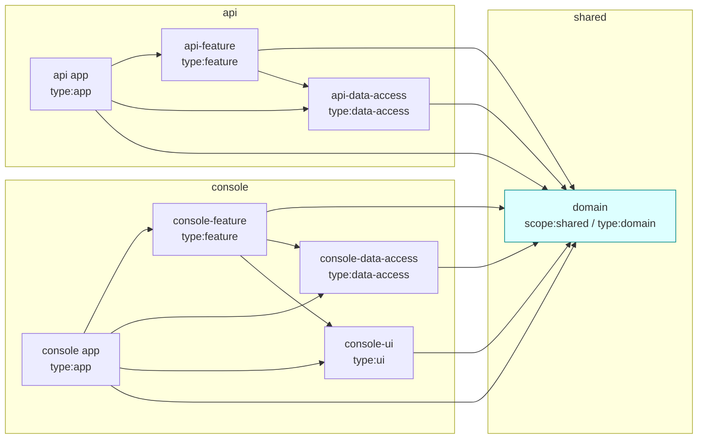

# Dependency Graph & Boundaries

Boundaries are **executable**, not merely documented: they are enforced by
`@nx/enforce-module-boundaries` in the root `eslint.config.mjs`. A violation is a
lint **error** (verified: importing `api-data-access` from `domain` fails lint).

## Tags

Every project carries a `scope:*` and a `type:*` tag (in each project's
`package.json` `nx.tags`, or the app's for apps):

| Project | scope | type |
| ------- | ----- | ---- |
| `@linkops/domain` | `scope:shared` | `type:domain` |
| `@linkops/api-data-access` | `scope:api` | `type:data-access` |
| `@linkops/api-feature` | `scope:api` | `type:feature` |
| `@linkops/console-data-access` | `scope:console` | `type:data-access` |
| `@linkops/console-feature` | `scope:console` | `type:feature` |
| `@linkops/console-ui` | `scope:console` | `type:ui` |
| `@linkops/api` (app) | `scope:api` | `type:app` |
| `@linkops/console` (app) | `scope:console` | `type:app` |

## Allowed dependency direction

Constraints use **AND** semantics: a dependency must satisfy *every* rule whose
`sourceTag` matches the importing project (both its scope rule and its type rule).



### Rules (as configured)

By **type**:

| sourceTag (`type:`) | onlyDependOnLibsWithTags |
| ------------------- | ------------------------ |
| `type:domain` | *(empty — depends on nothing)* |
| `type:data-access` | `type:domain` |
| `type:feature` | `type:domain`, `type:data-access`, `type:ui` |
| `type:ui` | `type:domain` |
| `type:app` | `type:feature`, `type:data-access`, `type:ui`, `type:domain` |

By **scope** (isolation):

| sourceTag (`scope:`) | onlyDependOnLibsWithTags |
| -------------------- | ------------------------ |
| `scope:api` | `scope:api`, `scope:shared` |
| `scope:console` | `scope:console`, `scope:shared` |
| `scope:shared` | `scope:shared` |

**Consequence:** `api` can never import `console` and vice-versa (their scope
rules exclude the other scope), and the domain (`scope:shared` / `type:domain`)
is a pure leaf that cannot import anything.

## Verifying

```bash
npx nx run-many -t lint     # boundary violations fail here
npx nx graph                # interactive project graph
```
