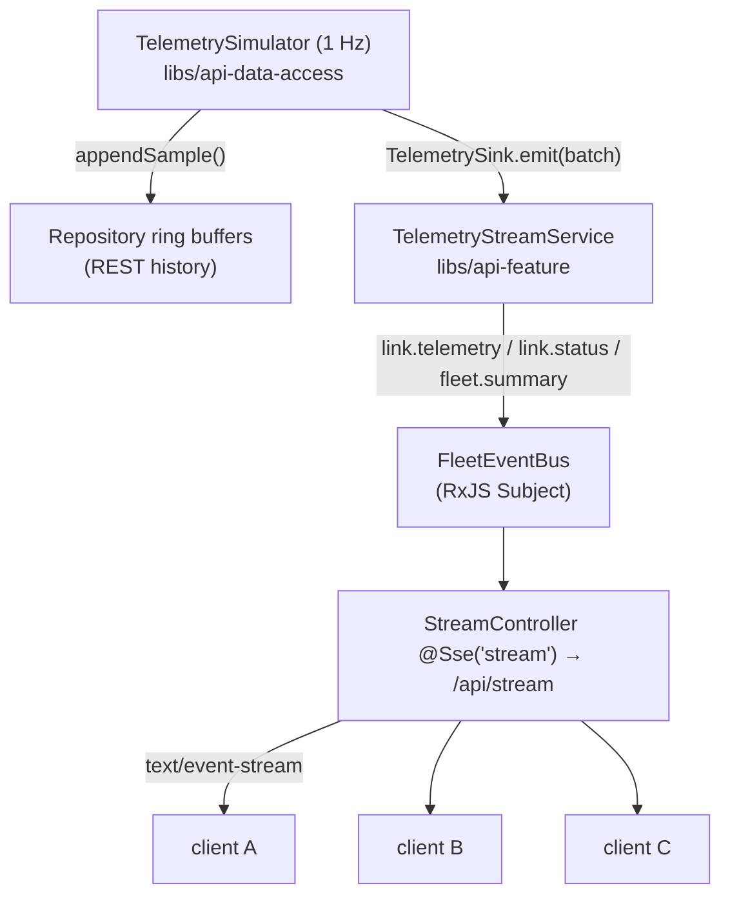

# Live Stream over SSE (M4)

> Scope: the M4 backend live-stream layer. It adds a single Server-Sent Events
> endpoint on top of the existing M1 domain, M2 simulator, and M3 REST API
> **without changing any of them**. The Angular client that consumes this stream
> is a later milestone (M5+).

## Purpose

One SSE endpoint, `GET /api/stream`, pushes live telemetry and status changes to
the browser so an operator sees the fleet move in real time. The stream is a
second **consumer** of the same telemetry the simulator already produces — it
does not replace the REST/history path.

## Requirement vs decision vs detail

To keep the reasoning honest, three categories are called out throughout:

- **Assignment requirement** — mandated by the PDF (§2 M4, §3 contract).
- **Approved architecture decision** — a choice the PDF leaves open that was
  reviewed and approved (the PDF explicitly says *"Decide and document"*).
- **Implementation detail** — a local choice with no architectural weight.

## Endpoint

| Method & path | Response | Notes |
| ------------- | -------- | ----- |
| `GET /api/stream` | `200 text/event-stream` | Events: `link.telemetry`, `link.status`, `fleet.summary`. |

**Routing (approved decision).** The whole API is served under a single `/api`
namespace, matching the PDF's suggested contract (`/api/links`,
`/api/fleet/summary`, `/api/stream`). This is realized with one
`app.setGlobalPrefix('api')` in `apps/api/src/main.ts`; controllers declare bare
routes, so the SSE endpoint is `@Sse('stream')` and the prefix makes its
effective path `/api/stream` (declaring `api/stream` there would double-prefix to
`/api/api/stream`). A single global prefix keeps REST and SSE uniform without
repeating `api/` on every controller.

## Event flow



The simulator tick writes to the repository (for REST/history) **and** hands the
same batch to the `TelemetrySink`. Both paths trace to one tick output, so REST
and SSE never diverge.

## Layer boundaries

- **`TelemetrySink`** — a framework-free **domain port** (`emit(samples)`). It
  exists so the simulator can hand off a completed batch without depending on
  RxJS/NestJS. The simulator (data-access) still depends only on the domain.
- **`FleetEvent`, `FleetEventBus`, `TelemetryStreamService`, `StreamController`**
  — all in **`api-feature`**. These are application/transport concepts, not
  domain concepts: the domain never learns the words `FleetEvent`, `SSE`, or
  `MessageEvent`.

Dependency direction is unchanged: `api-feature → domain + api-data-access`; no
reverse edge, no `api ↔ console`.

## Event contract

Payloads reuse the existing domain types (one source of truth):

```
event: link.telemetry
id: 1786625722351                       # informational only (see Reconnect)
data: {"linkId":"link-0001","ts":"2026-08-05T09:00:01.000Z","rssiDbm":-62,"snrDb":21,"throughputMbps":184}

event: link.status
data: {"linkId":"link-0001","status":"degraded","previous":"up"}

event: fleet.summary
data: {"total":10,"up":8,"degraded":2,"down":0,"avgThroughputMbps":180.4,"worstLinkId":"link-0002"}
```

- `link.telemetry.data` ≡ domain `TelemetrySample`; `fleet.summary.data` ≡ domain
  `FleetSummary` — no fields added or transformed.
- `link.status.data` = `{ linkId, status, previous }`, matching the PDF example
  exactly. `previous` is `null` on the **first** observation of a link (no prior
  status to transition from); the PDF defines no timestamp field here, so none is
  added. **(Requirement.)**
- `id:` on telemetry frames is the sample timestamp in epoch-ms — an
  **implementation detail**, informational only, **not** a replay key.

## Event cadence (approved decision — the PDF "decide and document")

The PDF asks to decide and document whether every sample is pushed or batched per
tick, and warns against re-rendering the UI *"once per message per link."* The
approved decision:

| Event | Cadence | Coalescing |
| ----- | ------- | ---------- |
| `link.telemetry` | one per sample (one per link per tick) | none — per-sample push is explicitly PDF-sanctioned |
| `link.status` | only when derived status **transitions** | naturally coalesced by transition detection |
| `fleet.summary` | exactly one per completed tick | one frame per tick regardless of fleet size |

**Coalescing/throttling — what this layer actually does.** Server-side, status
and summary events are already coalesced (transition-only; one/tick). Telemetry
is intentionally **not** coalesced server-side — the PDF explicitly permits
pushing every sample. The remaining concern the PDF raises — the *UI* not being
re-rendered per message per link — is a **client render** concern and is deferred
to the Angular milestone (M5: signal-based state, correct `@for` tracking, no
change-detection storm at 1 Hz). There is no UI in M4 to storm. This layer adds
**no** server-side batching/queueing abstraction, and holds **no** unbounded
application-level event backlog.

## Status derivation

`TelemetryStreamService` derives status via the domain `deriveLinkStatus`, using
each sample's own `ts` as "now" (a just-produced sample is never stale), so
transition detection is deterministic and clock-independent. It keeps a
`Map<LinkId, LinkStatus>` **only** for transition detection — it is never an
authoritative store. The simulator never derives or stores status (M1/M2
invariant preserved).

## Serialized batch processing

Telemetry batches are processed **strictly sequentially**. `emit()` chains each
batch onto an internal promise tail:

```
emit(batch) → tail = tail.then(() => handleTick(batch).catch(log))
```

A later batch cannot begin until the previous one has fully settled, even if the
repository/summary calls become genuinely asynchronous later. The chain is
failure-tolerant: a rejected batch is caught so the tail always resolves and the
next batch still runs. This guarantees deterministic per-tick ordering and
prevents the shared `lastStatus` map from racing between batches. `emit()` stays
synchronous (`void`); the simulator never awaits it and gains no coupling.

Per completed tick the deterministic order is: `link.telemetry`* → `link.status`*
→ `fleet.summary`.

## Subscriber lifecycle

- `FleetEventBus` is a hot RxJS `Subject`. Each SSE connection Nest opens becomes
  an **independent** subscription; there is no shared subscription and no manual
  broadcast, no global subscriber registry.
- **Disconnect cleanup (requirement):** when a client disconnects, Nest
  unsubscribes that observable — no per-client timer, queue, or leaked
  subscription. Other subscribers are unaffected.
- **Backpressure (approved decision):** no custom buffering layer. The Subject
  holds no backlog, the event rate is bounded upstream, and Nest's `res.write` is
  non-blocking — so a slow client cannot block others and per-client memory is
  bounded by the socket buffer. Nothing is queued, so telemetry is inherently
  latest-wins.

## Reconnect (approved decision — live-only)

The PDF requires reconnect *support*, not replay. Reconnect uses the browser's
native `EventSource` behavior and is **live-only**:

```
disconnect → EventSource reconnects → a fresh live subscription
```

There is **no** server-side replay buffer and **no** `Last-Event-ID`
reconstruction. Historical gaps are recovered through the existing REST endpoint
`GET /api/links/:id/telemetry`. The `id:` field is informational and never triggers
replay.

## Delete while streaming (requirement)

Deletion goes through the existing REST `DELETE /api/links/:id`. On the next tick the
stream service reads current links from the repository, so a deleted link:

- produces no further telemetry or status events,
- is pruned from the `lastStatus` map,
- is excluded from `fleet.summary` (its `total` drops),

with no stream or simulator crash and no effect on other subscribers.

## Shutdown

M4 integrates with the M3 Nest lifecycle — no new mechanism, no `process.exit`.
On shutdown the simulator stops, `FleetEventBus` completes its Subject on
`onModuleDestroy`, and active SSE observables complete so connected clients see a
clean stream termination.

## Tests

- **Unit:** event mapping (`FleetEvent → MessageEvent`), bus
  multicast/unsubscribe/no-replay/complete, stream-service telemetry-per-sample,
  status-on-transition, one-summary/tick, deleted-link pruning, serialized
  processing, failure isolation.
- **Integration (real Nest + real SSE socket):** `GET /api/stream` serves
  `text/event-stream` and delivers real simulator telemetry; status transition
  and no-repeat; one summary/tick; per-tick ordering with no cross-tick
  interleave; multi-client fan-out with disconnect isolation; live-only
  reconnect; delete-while-streaming via the real REST endpoint; failed-batch
  recovery; active-stream completion on shutdown.

## What is intentionally absent (M5+)

Angular client and `EventSource` consumption, client-side render coalescing,
`console-data-access` SSE wrapper, charts. See the README milestone table.
