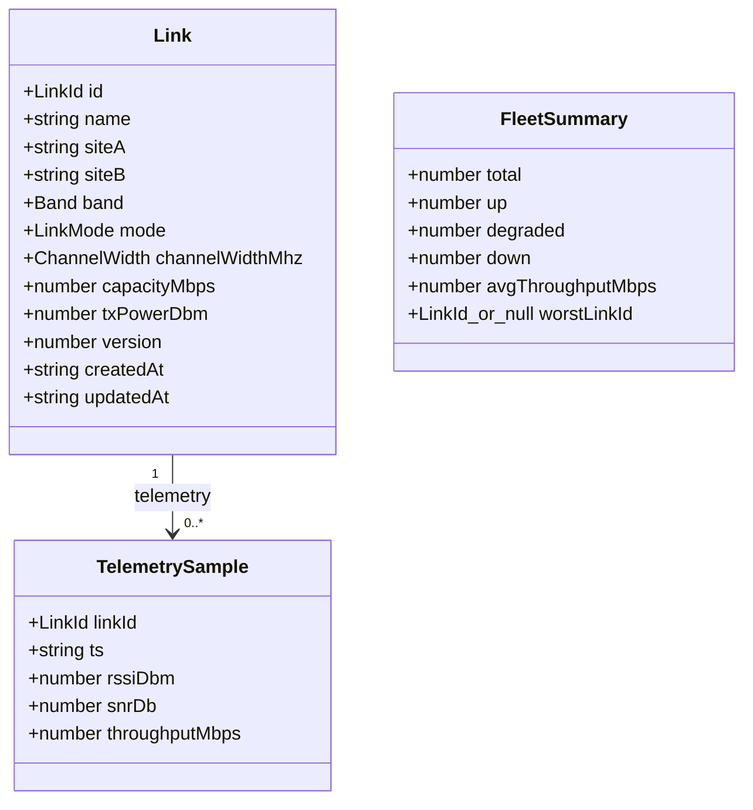
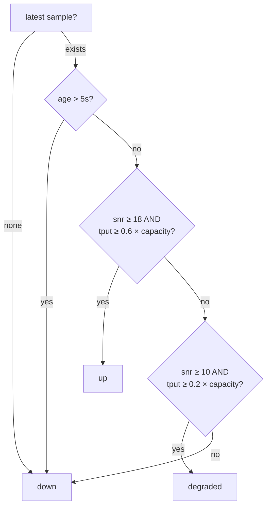
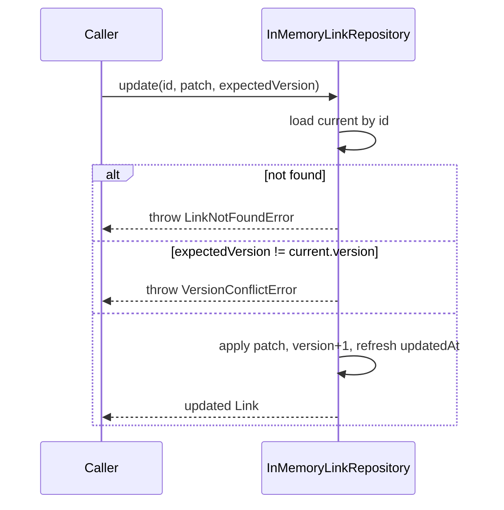

# System Overview

> Scope: describes the code that exists at **Milestone 1**. Layers marked
> *(shell)* exist as tagged, boundary-enforced placeholders and are implemented
> in later milestones.

## Purpose

The LinkOps Console manages a fleet of radio links and surfaces their live
operational status. The system is split so that the **rules of the domain** are
isolated from any transport, UI, or storage technology. That domain core is the
stable centre; everything else is a replaceable adapter around it.

## Layers

| Layer | Project | Tags | Responsibility (M1) |
| ----- | ------- | ---- | ------------------- |
| Domain | `libs/domain` | `scope:shared`, `type:domain` | Types, `deriveLinkStatus`, domain errors, `LinkRepository` contract. Depends on nothing. |
| API data access | `libs/api-data-access` | `scope:api`, `type:data-access` | `InMemoryLinkRepository`, `RingBuffer`, seed data. |
| API feature *(shell)* | `libs/api-feature` | `scope:api`, `type:feature` | Application services / orchestration (M3+). |
| Console data access *(shell)* | `libs/console-data-access` | `scope:console`, `type:data-access` | Client-side state / HTTP + SSE access (M4+). |
| Console feature *(shell)* | `libs/console-feature` | `scope:console`, `type:feature` | Smart components / routed views (M5+). |
| Console UI *(shell)* | `libs/console-ui` | `scope:console`, `type:ui` | Presentational components (M5+). |
| API app | `apps/api` | `scope:api`, `type:app` | Composition root. In M1 it only seeds the fleet and logs; NestJS HTTP arrives in M3. |
| Console app | `apps/console` | `scope:console`, `type:app` | Composition root. Angular UI arrives in M5. |

## Domain model (M1)

`LinkId` is a **branded string** (`string & { __brand: 'LinkId' }`) constructed
via `linkId(raw)`, which rejects empty/whitespace input. Branding stops a raw
string from being used where a validated id is required, without any runtime cost.

## Status derivation

`deriveLinkStatus(link, latest, now)` is a pure function. The current time is
**passed in** (never read from the clock inside the function), which keeps status
evaluation deterministic and unit-testable. Rules are evaluated top-down:

No hysteresis in M1. Thresholds live in a single exported constant
(`LINK_STATUS_THRESHOLDS`).

## Persistence (M1)

`LinkRepository` is defined in the domain layer with **async** CRUD so a future
durable store (e.g. MongoDB) can replace the in-memory implementation without
changing feature-layer call sites. Telemetry access is synchronous — it is served
from an in-process bounded ring buffer.

`InMemoryLinkRepository`:

- Links: `Map<LinkId, Link>`.
- Telemetry: one **bounded `RingBuffer`** per link (default 300 samples ≈ 5 min
  at 1 Hz) — O(1) append, oldest overwritten, never grows past capacity.
- **Optimistic concurrency:** `update` requires an `expectedVersion`; a mismatch
  throws `VersionConflictError` and the stored entity is left untouched. On
  success the version is incremented and `updatedAt` refreshed.
- **Name invariants:** link names must be 3–40 characters (`InvalidLinkNameError`)
  and unique across the fleet (`DuplicateLinkNameError`), enforced on create/update.
- Clock and id generation are injectable, so the repository is fully deterministic
  under test.
- **`getSamples(id, windowMs)`** windows relative to the newest stored sample
  (deterministic, clock-independent). This semantics must be revisited in M2/M3
  once real telemetry timestamps and the REST telemetry-window contract exist.
- Seed fleet: 10 deterministic links (assignment requires 8–12).

### Update flow

## Telemetry simulation (M2)

The 1 Hz `TelemetrySimulatorService` (in `libs/api-data-access`) fills the ring
buffers so derived status becomes meaningful. It generates one sample per link
per tick, drifts values plausibly, and occasionally degrades a link — without
ever writing status. See [`telemetry.md`](telemetry.md) for the full design.

## REST API (M3)

A real NestJS REST layer lives in `libs/api-feature` (controllers, DTOs,
application services, global validation pipe, and a global exception filter with
a consistent error envelope). It reaches storage only through the
`LinkRepository` abstraction, and the telemetry simulator is a NestJS-managed
provider with Nest-owned startup/shutdown. See [`rest-api.md`](rest-api.md).

## What is intentionally absent (M4+)

EventBus, SSE and reconnect, Angular UI and charts, MongoDB, Docker/Kubernetes.
See the README milestone table.
