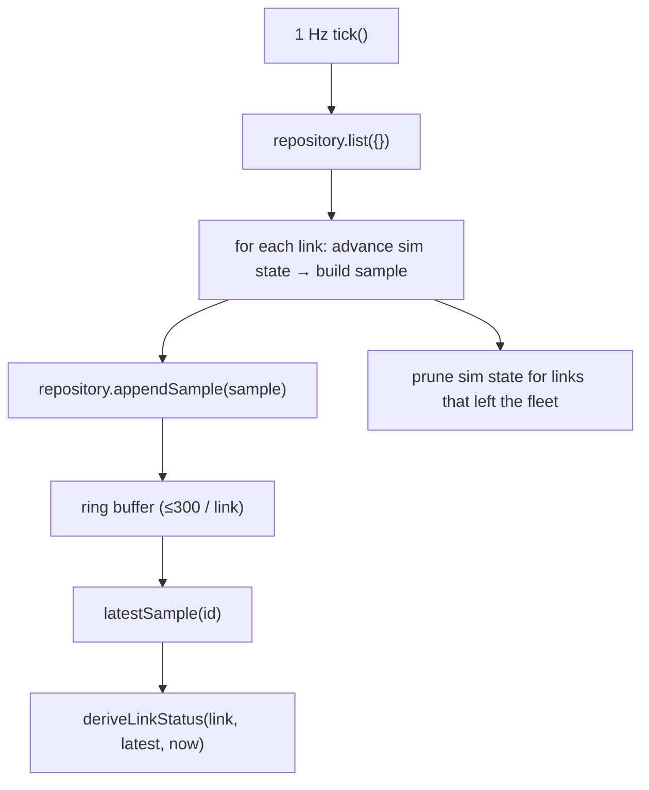

# Telemetry Simulation (M2)

> Scope: describes the M2 telemetry simulator. REST (M3), SSE/EventBus (M4), and
> the UI (M5+) are **not** implemented yet and are only referenced as future
> consumers.

## Responsibility

`TelemetrySimulatorService` (in `libs/api-data-access`) is the infrastructure
service that generates plausible radio telemetry for the whole fleet and feeds
it into the existing repository ring buffers. It lives in the data-access layer,
**not** in `libs/domain` — the domain stays framework-independent and owns only
the sample shape (`TelemetrySample`) and the health rule (`deriveLinkStatus`).

## One global 1 Hz timer

There is exactly **one** `setInterval(tick, 1000)` for the entire fleet — not one
timer per link, per subscriber, or per repository entry. Every link is advanced
on the same simulation instant, which keeps the fleet synchronized and avoids
timer multiplication. `start()` is idempotent (guards against duplicate
intervals); `stop()` clears it.



## Testable tick vs scheduling

Scheduling and tick logic are separated so tests never sleep:

- `tick()` — public, executes one fleet pass; tests call it directly.
- `start()` / `stop()` — own the single `setInterval`; verified with fake timers.

Clock (`clock: () => number`, epoch ms) and randomness (`random: () => number`)
are injectable, so timestamps and drift/degradation are fully deterministic under
test. Defaults are `Date.now` and `Math.random`. No heavy DI framework is used.

## Telemetry generation

Each tick produces exactly one `TelemetrySample` per link:

```
{ linkId, ts, rssiDbm, snrDb, throughputMbps }
```

`ts` is ISO-8601; all samples in a tick share one timestamp.

### Plausible drift (random-walk)

Values evolve from their previous state rather than being redrawn independently:

```
next = clamp(current + towards(target, maxStep) + jitter, bounds)
```

Ranges and step sizes are **implementation decisions** (documented constants in
`SIMULATOR_DEFAULTS`), not RADWIN device specifications:

| Metric | Bounds | Healthy target | Per-tick step + jitter |
| ------ | ------ | -------------- | ---------------------- |
| `rssiDbm` | −90 … −40 dBm | −55 | ±4 + ~±1.0 |
| `snrDb` | 0 … 40 dB | 28 | ±3 + ~±0.8 |
| `throughputMbps` | 0 … capacity | 0.85 × capacity | ±0.10·cap + ~±0.03·cap |

Throughput is always clamped to `[0, capacityMbps]`. Values change gradually and
stay plausible — the fleet neither looks static nor oscillates chaotically.

### Occasional degradation + recovery

Degradation is a controlled simulation behavior, **not** a status assignment.
Each eligible link has a small per-tick probability of starting a bounded
episode (6–15 ticks). During an episode the drift target switches to a degraded
operating point (`snrDb ≈ 12`, `throughput ≈ 0.35 × capacity`) that lands inside
the domain's **DEGRADED band**, so `deriveLinkStatus` naturally reports
`degraded`. When the episode ends the link recovers toward healthy and enters a
cooldown, so:

- links do not all degrade at once,
- no link stays permanently degraded,
- the simulator never sets `Link.status`.

## Status is derived, never persisted

The simulator only shapes telemetry. Health is always computed on demand:

```
deriveLinkStatus(link, repository.latestSample(link.id), now)
```

There is no writable/persisted status field and no client-writable status.

## Ring-buffer ownership & memory bounds

The repository's per-link `RingBuffer` (capacity **300**, from M1) remains the
single authoritative in-memory telemetry window. The simulator keeps only
**O(fleet)** scalar state per link (current rssi/snr/throughput + a degradation
counter and cooldown) — it never accumulates a sample history of its own. For
`N` links total telemetry memory is bounded at `N × 300` samples regardless of
how long the simulator runs (verified: 400 ticks → buffer length stays 300).

## Lifecycle

The simulator starts with the API process and stops cleanly on shutdown. Its
methods are named `onModuleInit()` / `onApplicationShutdown()` to match the
NestJS lifecycle interfaces **structurally**, so when M3 introduces NestJS this
service can be registered as a provider and have start/stop wired automatically —
without coupling the data-access layer to NestJS in M2. Today the API shell calls
`start()` directly and `stop()` on `SIGINT`/`SIGTERM`.

## Fleet membership changes

`tick()` reads the current links from the repository each pass, so a link created
later is simulated automatically on the next tick, and a deleted link is no
longer simulated (its ring buffer and simulation state are dropped). A link
disappearing between operations does not crash the tick. REST create/delete APIs
are **not** part of M2; this behavior is exercised directly against the
repository + simulator.

## Complexity

`O(number of links)` work per tick. For the assignment fleet (8–12 links) a
single 1 Hz tick is trivially sufficient. Scaling toward thousands of links
(sharded timers, backpressure, etc.) belongs in the scalability discussion, not
the M2 implementation.

## Evolution to M4

Telemetry produced here will be consumed by the future **M4 stream layer** (SSE),
which will publish sample/status changes to clients. M2 deliberately keeps the
simulator and any event-publishing concern separate: no EventBus, message broker,
or SSE infrastructure is introduced yet.
